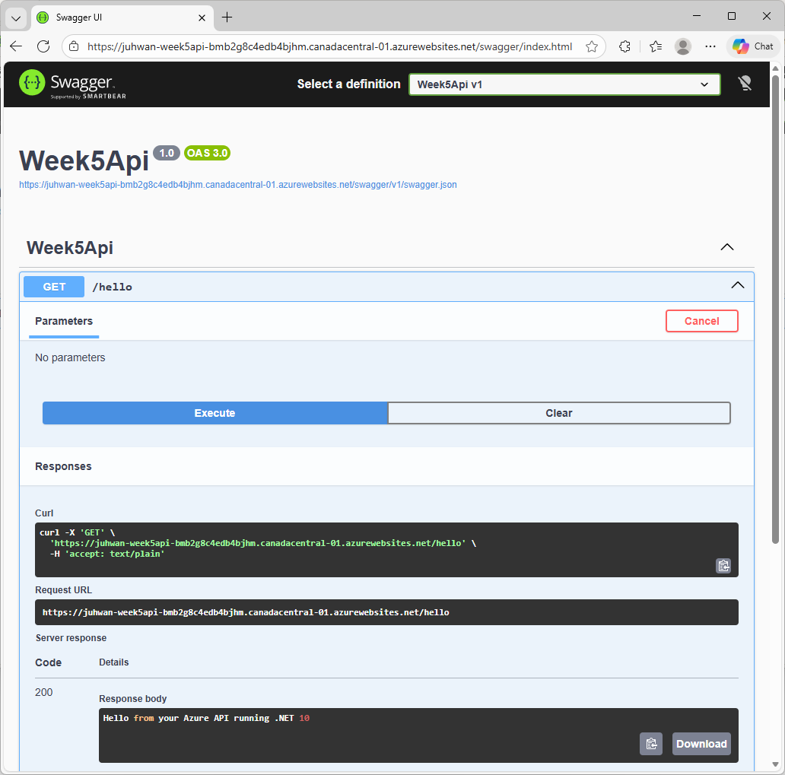
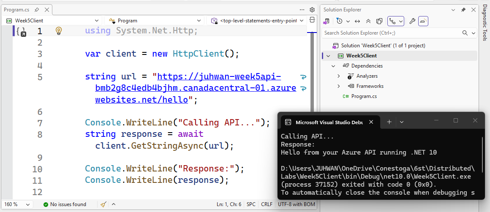

# WEEK 5 LAB: Deploying a .NET 10 Web API to Azure App Service Using GitHub CI/CD and Creating a C# Client

Course: PROG3176 - Winter 2026 - Section 1  
Programmed by: Juhwan Seo [8819123] 

## Deployment
This application is automatically deployed to Azure through GitHub Actions.  
*\* Any push to the main branch triggers the deployment pipeline.*

## API Endpoints

### GET /hello
- **URL**: [https://juhwan-week5api-bmb2g8c4edb4bjhm.canadacentral-01.azurewebsites.net/hello](https://juhwan-week5api-bmb2g8c4edb4bjhm.canadacentral-01.azurewebsites.net/hello)
- **Response**: `"Your API has been updated through CI and CD"`

### Swagger Documentation
- **URL**: [https://juhwan-week5api-bmb2g8c4edb4bjhm.canadacentral-01.azurewebsites.net/swagger](https://juhwan-week5api-bmb2g8c4edb4bjhm.canadacentral-01.azurewebsites.net/swagger)

## Screenshots

### 1. Swagger UI Running on Azure

*The Swagger interface shows the /hello endpoint documentation and allows testing the API directly in the browser.*

### 2. Console Client Output

*The C# console application successfully calls the deployed Azure API and displays the response.*

## CI/CD Pipeline

### How CI and CD Work in Azure

The CI/CD pipeline in this project uses GitHub Actions to automate the build and deployment process. When changes are pushed to the main branch, GitHub Actions automatically triggers the workflow that builds the application, runs tests, and deploys the compiled application to Azure App Service.

#### GitHub Actions Workflow
The workflow file ([`.github/workflows/main_juhwan-week5api.yml`](.github/workflows/main_juhwan-week5api.yml)) was automatically generated by Azure when configuring the deployment center in the Azure Portal. This YAML file defines the complete CI/CD pipeline with the following key components:

**Key Actions:**

**Build Job (`build`):**
- **`actions/checkout@v4`**: Checks out the repository code
- **`actions/setup-dotnet@v4`**: Sets up .NET 10 SDK environment
- **`dotnet build --configuration Release`**: Builds the application in release mode
- **`dotnet publish -c Release`**: Publishes the application for deployment
- **`actions/upload-artifact@v4`**: Uploads the built application as an artifact

**Deploy Job (`deploy`):**
- **`actions/download-artifact@v4`**: Downloads the artifact from build job for deployment
- **`azure/login@v2`**: Performs **Azure Managed Identity Authentication** (OIDC) for secure access
- **`azure/webapps-deploy@v3`**: Deploys the application to Azure App Service

**Flow Diagram:**
```
Source Code → Build → Artifact Creation → Artifact Storage → Artifact Download → Azure Authentication (Secure Access) → Azure Deployment
```

**Workflow Execution & Artifacts**: [View CI/CD Pipeline in Action](https://github.com/Juhwan21st/Lab3-Week5Api/actions/runs/22029881241)

## Technologies Used

- **.NET 10** - Web framework
- **Azure App Service** - Cloud hosting platform
- **GitHub Actions** - CI/CD automation
- **Swashbuckle.AspNetCore** - API documentation
- **Minimal APIs** - Lightweight API development
